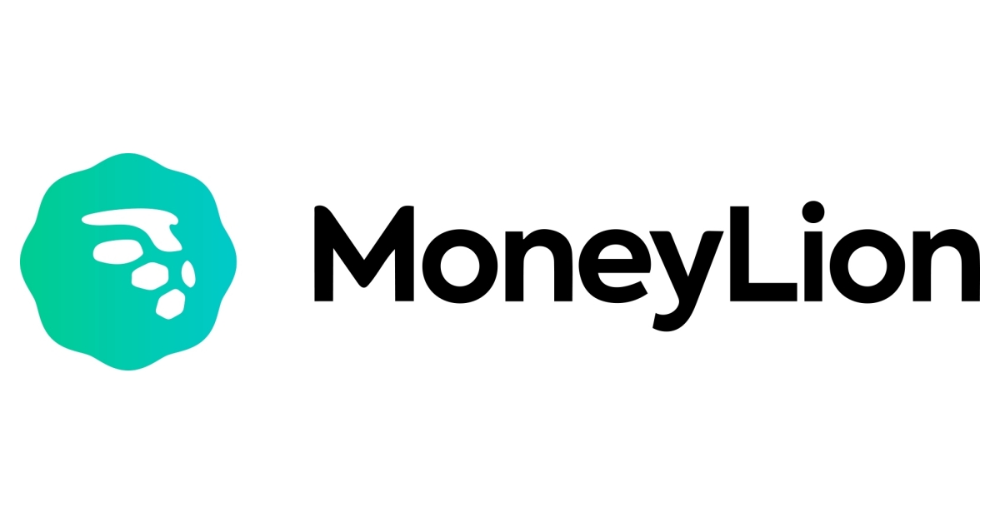
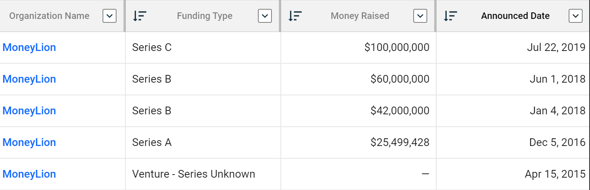
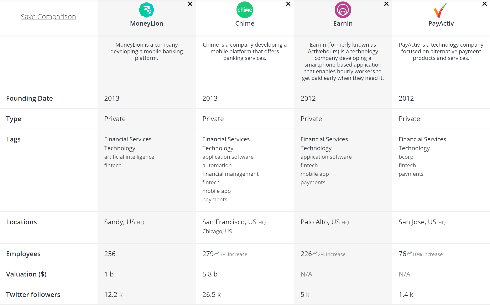

# Moneylion Fintech Case Study

***
##  Overview and Origin:

Moneylion is a mobile finance platform that uses techonolgy to provide a more updated borrowing, saving and investing product suite to consumers. The company was founded by technologists and financiers

MoneyLion was founded in 2013 by:
   
1. Diwakar Choubey 
     - Co-founder and CEO of MoneyLion who started his career in investment banking focusing on M&A and payments.
2. Pratyush Tiwari 
     - Co-founder and CIO of MoneyLion with experience in Software As A Service at Credit Suisse.
3. Chee Mun Foong 
    - Co-founder and CTO of Moneylion with experience in artificial intelligence in another company he founded; Simulex.

***    
  
In in an interview with Medium.com, CEO Diwakar admits that the idea for MoneyLion originated from large banks backing away from consumer business as a result of the financial crisis and the subsequent regulations that followed. The vacume that the large banks left behind was an oportunity that stared him in the face. He did not have the thechnical or egineering expertise to seize on this venture on his own. He did, however, have two other co-founders who understood the technology side of things. Diwakar further explains the origins of MoneyLion:

 > We were also excited that consumers at the time were showing a growing appetite for utilizing online banking services that reduced transaction times and made banking less intrusive to their lives. This led us to our decision to start MoneyLion in 2013 with the underlying feeling that this was an incredible opportunity to build and reimagine the consumer financing brand. 

According to Crunchbase.com, MoneyLion has achieved 6 rounds of outside investments. Below is a breakdown of how the company has raised funding from it's infancy stage to its mature stage of series C funding in order to pursue scalability. MoneyLion has raised $227.5M to date through 12 total investors. 

## Business Activities:

* Moneylion sets out to solve many personal finance and banking issues, but the primary function that sets them appart is the personal loan. Their marketing presents this product offering as "borrowing from your future self." they offer this short term loan with no interest. Beyond that, the company combines AI, machine learning, big data and behavioral science to provide smart and fexible financial solutions to consumers that range from banking to loans to investing. 

MoneyLion, from its outset, has been targeting consumers that large banks seemingly are reluctent to service. it would be logical to think that those consumers are middle to low income people who need a flexible loan system that would make up for their inadequate income. In terms of the size of P2P lending, the industry is valued at $15 billion and is expected to grow to $44 billion by 2024. According to my research, its pretty rare for a company to provide banking, lending and brokerage services all on one platform. I think this is MoneyLion's greatest strenght. If they are able to maintin a quality ballance between the three, they will always have a headstart in this product package. 

MoneyLion in broad terms uses big data, AI and machine learnin. One example of how AI might help is tracking a customer's transactions and based on that tracking, the AI can make suggestions that might help with decision making. MoneyLion don't see themselves as a bank or a brokerage firm or a P2P lender. They see themselves as a financial wellness company that uses data and technology to interface with those aforementioned services. More specifically, I noticed in their careers page that they look for engineers with experience in Mongo DP, Java, linux administration, AWS, Swift and APIs. 

## Landscape:

This companies domain is distinctly lending, but beyond that, they offer many personal banking solutions. Acording to the CEO, they are primarily a financial wellness company. The reason they might consider themselves this way is realted to the amount of financial services they provide. being able to save, borrow and invest all in one app gives a lot of financial flexability to their consumers. Beyond that, AI driven advising, readily available credit score, and credit card promotions all in one app makes this a very robust financial tool for consumers. 

The most major trend and innovation in this domain has been the speed at which the bank can provide the loan. In their marketing, they say they can provide a loan within 15 seconds. This innovation was so impactful that it has carved out its own sector known as Peer 2 Peer lending. 

there are other major competitors in this domain, though they may not have the same robust suite of personal banking products. Earnin is a competitor that provides instananeous loans and certain financial products related to healthcare. Another major competitor is PayActiv. They offer a wide variety of services including interfacing with ADP, pharmaceutical discounts, and rideshare apps.

## Results

The company has had a pretty substantial business impact. MoneyLion's business model innately brings in other companies. As an example, MoneyLion has promotions within their app that advertises credit opportunities for customers. The poromotions are taylored for each consumer through machine learning. 

The main metric for a company like MoneyLion is monthly app donwloads. According to Crunchbase.com, MoneyLion is at 145,909 downloads a month. According to craft.com, they have 5 million users when it was last measured in the summer of 2019. the company is valued at around $1 billion. 

Comparing MoneyLion to one of it's main competitors like Chime shows that MoneyLion could do some more growing. Chimes market valuation is $5.8 billion and they have nearly the same customer base of 5 million users measured in the summer of 2019. Other Competitors like Earnin and Payactive are not as popular despite having started a year prior. though there aren't solid metrics to compare them on that level, craft.com makes a comparison between their social media followers and Moneylion sits second to Chime if we compare the four. Below is an image comparing the companies across various categories.

## Recommendations

Its really hard to imagine what I could suggest that MoneyLion offer considering how robust they are already. But if I could see a gap in their business model it would probably be somekind of Healthcare financing option. THey claim to be a financial wellness company and nothing impacts a consumers financial wellness like crazy healhcare bills. If they could offer some sort of financial vehicle that would alleviate burden from healthcare bills, they would definitely take a deeper bite into the financial wellness industry. Maybe something with blockchain might help keep equity between a customer's financial situation and the healthcare costs. This technology is apporpriate because saying that overhead costs in insurance products is not optimal isn't a controversial statement. The transparency that blockchain brings married with a consumers financial flexibility and healthcare costs could potentially save consumers a lot of money. 

Sources:
1. https://www.rblt.com/fintech-summit-panel-members/diwakar-dee-choubey

2. https://www.linkedin.com/in/deechoubey/

3. https://www.lendit.com/usa/2016/speakers/pratyush-tiwari

4. https://www.crunchbase.com/organization/moneylion#section-lists-featuring-this-company

5. https://www.vbprofiles.com/people/chee-mun-foong-585ffe2c3893179dd6000002

6. https://medium.com/@SimpleInnovativ/fireside-chat-with-co-founder-and-ceo-of-moneylion-diwakar-choubey-c12626975c8

7. https://www.prnewswire.com/news-releases/global-peer-to-peer-lending-market-is-valued-at-around--15-billion-in-2018-and-the-market-is-poised-to-grow-at-cagr-of-over-19-to-surpass--44-billion-by-2024-300907528.html

8. https://craft.co/moneylion https://craft.co/chime

